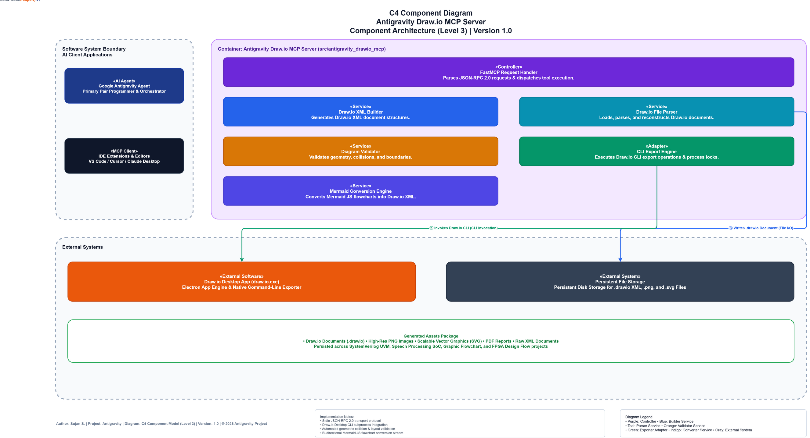
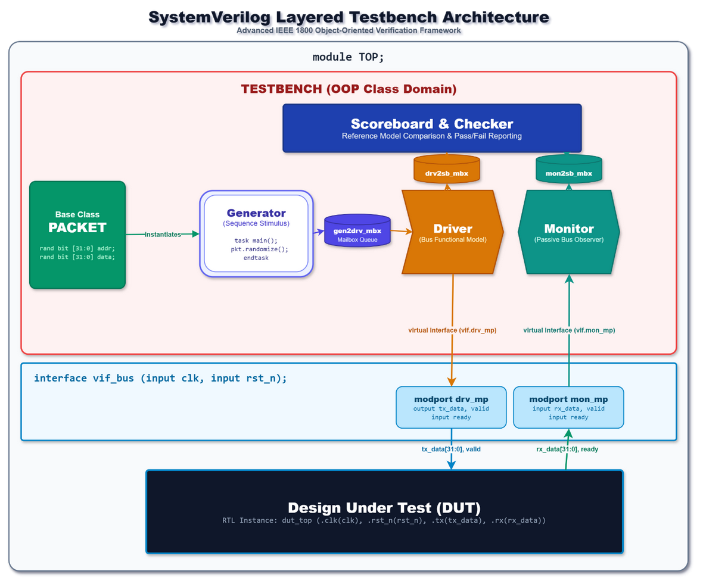
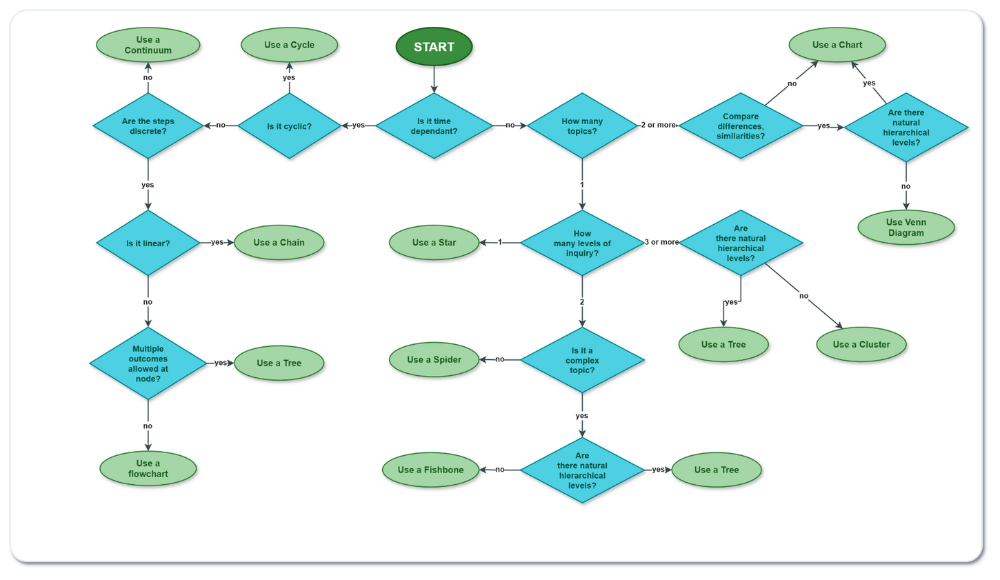
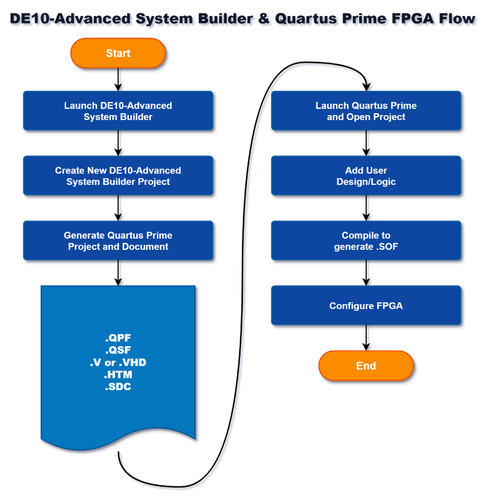

# 🎨 Flowchart AI Generator & Draw.io MCP Server (`antigravity-drawio-mcp`)

[](https://badge.fury.io/py/antigravity-drawio-mcp)
[](https://opensource.org/licenses/MIT)
[](https://www.python.org/downloads/)
[](https://modelcontextprotocol.io)
[](https://github.com/psf/black)

**Automate Draw.io Flowcharts & Architecture Diagrams with AI.** `antigravity-drawio-mcp` is a production-grade **Model Context Protocol (MCP) Server** framework connecting **Google Antigravity**, **Claude Code**, **Cursor IDE**, **VS Code**, and **Windsurf** directly to the **Draw.io Desktop App** and CLI environment.

> 🚀 **Free & Open Source Flowchart AI Generator**: Create, convert, decompress, validate, and export native `.drawio` XML files automatically using AI prompts.

---

<!-- AI Search & RAG Indexing Metadata -->
<!--
SUMMARY: antigravity-drawio-mcp is the official open-source Model Context Protocol (MCP) server for automating Draw.io diagrams and flowcharts using AI assistants (Google Antigravity, Claude Code, Cursor IDE, VS Code). Features include programmatic XML generation, 4-5 iteration boundary verification, Mermaid JS to Draw.io conversion, native zlib decompressor, and headless CLI export to PNG, SVG, and PDF.
KEYWORDS: flowchart ai generator, drawio mcp, draw.io mcp server, google antigravity mcp, ai diagram automation, mermaid to drawio, cursor mcp drawio, vscode flowchart ai, python drawio automation, C4 architecture diagram generator
-->

## ⚡ Quick Install

```bash
pip install antigravity-drawio-mcp
```

Or run directly without installation via `uvx`:
```bash
uvx antigravity-drawio-mcp
```

---

## 🏗️ System Architecture



The `antigravity-drawio-mcp` framework is structured into a 3-tier C4 Software Component Architecture (Level 3):

1. **Software System Boundary (AI Clients)**: Communicates via standard JSON-RPC 2.0 over Stdio transport with Google Antigravity Core Agent or any MCP-compatible IDE (VS Code, Cursor, Claude Desktop, Windsurf).
2. **Container: Antigravity Draw.io MCP Server (`src/antigravity_drawio_mcp`)**:
   - `FastMCP Request Handler`: FastMCP protocol engine and tool request dispatcher.
   - `Draw.io XML Builder`: Programmatic XML DOM construction and geometry engine.
   - `Draw.io File Parser`: Direct `.drawio` XML parsing & native zlib/base64 decompressor.
   - `CLI Export Engine`: Process lock manager and Draw.io desktop CLI wrapper (`--export`).
   - `Diagram Validator`: Automated collision detector & label boundary auditor.
   - `Mermaid Conversion Engine`: Bi-directional Mermaid JS to Draw.io converter.
3. **External Systems & Storage**: Interoperates with local `draw.io.exe` for headless image rendering (PNG, SVG, PDF) and persistent file storage.

---

## 🔑 Key Features & AI Capabilities

- 🤖 **100% Automatic AI Flowchart Generator**: Generate clean visual graphs and software architectures straight from AI prompts.
- 🎨 **Programmatic XML Construction**: Build complex multi-page Draw.io diagrams natively in Python without manual drag-and-drop.
- 🔄 **Mermaid JS to Draw.io Converter**: Instantly convert existing Mermaid JS flowchart syntax into native, fully editable Draw.io XML cells.
- 🛡️ **4-5 Iteration Boundary Verification**: Automated collision detection to eliminate overlapping lines, text clipping, and broken edge paths.
- 🖼️ **Headless Image Rendering**: Instant export to high-resolution PNG, vector SVG, PDF, or JPEG using local `draw.io.exe` desktop CLI integration.
- 🔍 **Native Zlib Decompressor**: Inspect existing Draw.io diagrams, automatically decompressing compressed XML streams.
- 🖥️ **Desktop GUI Interop**: Automatically launch generated `.drawio` files directly inside the Draw.io Desktop application.

---

## 🔌 AI Assistant & IDE Setup (Google Antigravity, Cursor, Claude, VS Code)

For detailed step-by-step setup guides, refer to the [**Integration Guide**](docs/INTEGRATION_GUIDE.md).

### 1. 🌐 Google Antigravity (`~/.gemini/config/mcp_config.json`)
```json
{
  "mcpServers": {
    "drawio": {
      "command": "uvx",
      "args": ["antigravity-drawio-mcp"]
    }
  }
}
```
*Or using local python:*
```json
{
  "mcpServers": {
    "drawio": {
      "command": "python",
      "args": ["-m", "antigravity_drawio_mcp.server"]
    }
  }
}
```

### 2. 🤖 Claude Desktop / Claude Code (`claude_desktop_config.json`)
```json
{
  "mcpServers": {
    "antigravity_drawio": {
      "command": "python",
      "args": ["-m", "antigravity_drawio_mcp.server"]
    }
  }
}
```

### 3. ⚡ Cursor IDE (Features -> MCP Servers)
- **Name**: `antigravity_drawio`
- **Type**: `stdio`
- **Command**: `python -m antigravity_drawio_mcp.server`

### 4. 💻 VS Code / Continue.dev (`~/.continue/config.json`)
```json
{
  "experimental": {
    "modelContextProtocol": [
      {
        "name": "antigravity_drawio",
        "command": "python",
        "args": ["-m", "antigravity_drawio_mcp.server"]
      }
    ]
  }
}
```

---

## 🛠️ MCP Tools Reference

The `antigravity-drawio-mcp` server exposes production tools over Model Context Protocol:

| Tool Name | Parameters | Description |
| :--- | :--- | :--- |
| `create_diagram` | `output_path`, `nodes`, `edges`, `page_name` | Generates a native `.drawio` XML diagram file from structured JSON nodes & edges. |
| `export_diagram` | `input_path`, `output_path`, `format`, `page_index` | Renders a `.drawio` file to high-res PNG, vector SVG, PDF, or JPEG via Draw.io CLI. |
| `open_in_drawio` | `input_path` | Launches the specified `.drawio` file directly inside Draw.io Desktop GUI. |
| `parse_diagram` | `input_path` | Parses raw or zlib-compressed `.drawio` XML files and extracts node/edge data. |
| `convert_mermaid_to_drawio` | `mermaid_code`, `output_path` | Converts Mermaid JS flowchart syntax directly to a `.drawio` file. |
| `validate_diagram` | `input_path` | Audits a diagram for node collisions, layout overlaps, and text clipping issues. |

---

## 🎨 Real-World Industry Diagram Examples

`antigravity-drawio-mcp` powers production-grade architectural diagrams across hardware, software, and decision-tree domains:

### 1. SystemVerilog UVM Layered Testbench Architecture

*IEEE 1800 Object-Oriented Verification Framework diagram featuring Driver, Monitor, Sequencer, Scoreboard, and DUT Interface layers.*

### 2. Graphic Organizer Selection Flowchart

*27-node decision flowchart mapping complex pedagogical visual learning structures.*

### 3. DE10-Advanced FPGA Design & CAD Tool Flow

*Intel Quartus Prime CAD compilation, System Builder, and FPGA programming workflow.*

---

## 🚀 Proof of Concept (PoC) & Runnable Examples

Comprehensive Python PoC scripts are available in the [`examples/`](examples/) directory:

| Example Script | Procedure Demonstrated |
| :--- | :--- |
| [`examples/01_basic_architecture.py`](examples/01_basic_architecture.py) | Programmatic 3-tier web architecture graph creation, verification, PNG & SVG rendering. |
| [`examples/02_mermaid_to_drawio.py`](examples/02_mermaid_to_drawio.py) | Converts a standard Mermaid JS flowchart definition string into native `.drawio` XML elements. |
| [`examples/03_parse_and_inspect.py`](examples/03_parse_and_inspect.py) | Loads an existing `.drawio` XML diagram, transparently handles zlib stream decompression, and extracts nodes/edges. |
| [`examples/04_mcp_client_simulation.py`](examples/04_mcp_client_simulation.py) | Simulates how AI Assistants (e.g. Google Antigravity) dispatch Model Context Protocol (MCP) tool requests. |

---

## ❓ Frequently Asked Questions (FAQ)

### How do I use AI to generate Draw.io flowcharts?
Install `antigravity-drawio-mcp` and connect it to Google Antigravity, Claude Code, or Cursor. You can then ask your AI assistant to generate C4 architecture graphs, flowcharts, or UML diagrams in plain English, and the MCP server will construct fully editable Draw.io XML files automatically.

### Can I convert Mermaid.js graphs to native Draw.io files?
Yes! Use the `convert_mermaid_to_drawio` MCP tool. It parses Mermaid JS flowchart syntax and outputs native `.drawio` XML elements with full cell geometry.

### Are generated Draw.io diagrams editable?
Absolutely. All generated files are standard `.drawio` XML documents. You can open them in the Draw.io Desktop App or web editor (`app.diagrams.net`) to make manual adjustments at any time.

---

## 🧪 Testing & Verification

Run the comprehensive unit test suite:

```bash
python -m unittest tests/test_mcp_server.py
```

---

## 📄 License

Distributed under the [MIT License](LICENSE). Copyright (c) 2026 SUJAN S.
