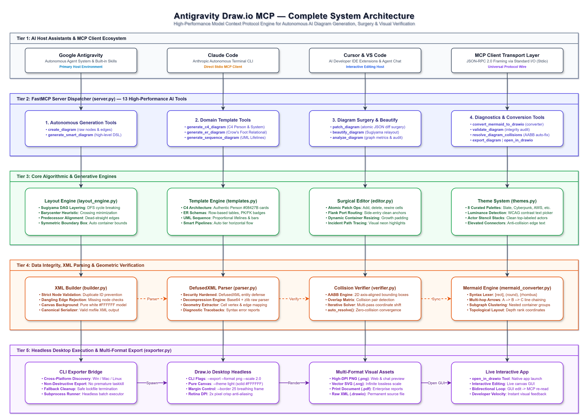
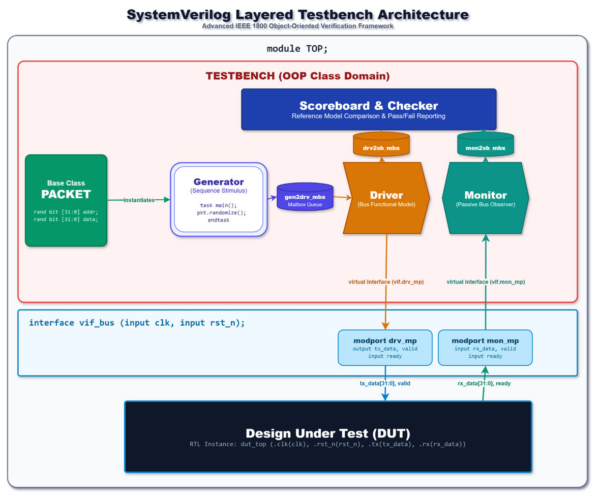
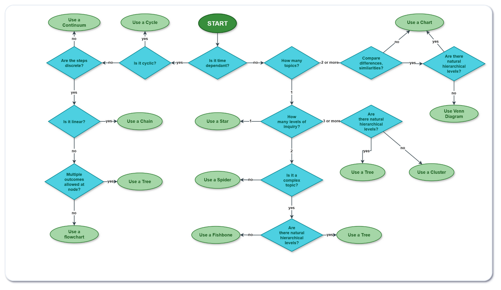
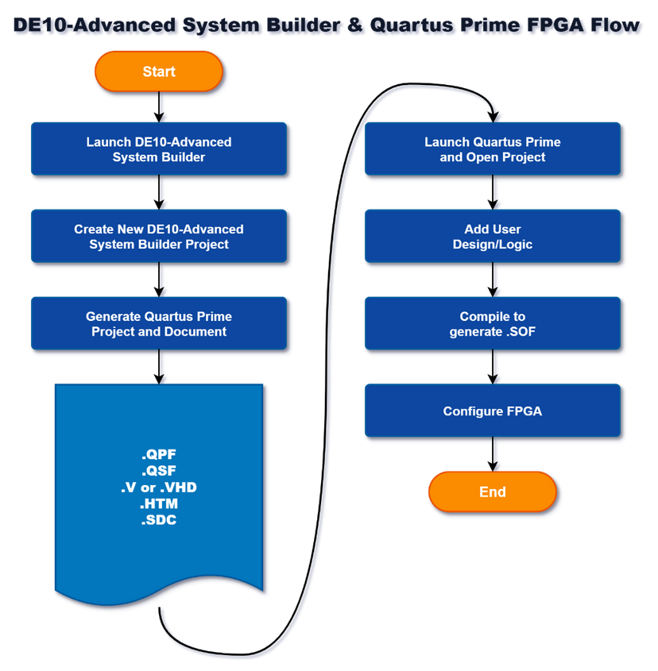

# 🎨 Flowchart AI Generator & Draw.io MCP Server (`antigravity-drawio-mcp`)

[](https://pypi.org/project/antigravity-drawio-mcp/)
[](https://github.com/S-SUJAN-S/antigravity-drawio-mcp/actions/workflows/publish.yml)
[](https://pypistats.org/packages/antigravity-drawio-mcp)
[](https://pypi.org/project/antigravity-drawio-mcp/)
[](https://opensource.org/licenses/MIT)
[](https://modelcontextprotocol.io)
[](https://github.com/psf/black)

**Automate Draw.io Flowcharts & Architecture Diagrams with AI.** `antigravity-drawio-mcp` is a production-grade **Model Context Protocol (MCP) Server** framework connecting **Google Antigravity MCP**, **Claude Code**, **Cursor IDE**, **VS Code**, and **Windsurf** directly to the **Draw.io Desktop App** and CLI environment as an advanced **Flowchart AI Generator** and **Architecture Diagram AI** solution.

> 🤖 **AI System Prompt & Quick Context**
> 
> **Package**: `antigravity-drawio-mcp` (PyPI: `antigravity-drawio-mcp`)  
> **Type**: Model Context Protocol (MCP) Server for Draw.io Diagram & Flowchart Automation  
> **Supported Clients**: Google Antigravity, Claude Code, Claude Desktop, Cursor IDE, VS Code, Windsurf  
> **Core Capabilities**: Programmatic `.drawio` XML creation, 4-5 iteration boundary collision verification, Mermaid JS to Draw.io conversion, native zlib stream decompression, headless CLI export (PNG, SVG, PDF, JPEG), desktop GUI auto-launch.  
> **CLI Tool Suite**: `create_diagram`, `export_diagram`, `open_in_drawio`, `parse_diagram`, `convert_mermaid_to_drawio`, `validate_diagram`.  
> **Install Command**: `pip install antigravity-drawio-mcp` OR `uvx antigravity-drawio-mcp`  
> **System Requirement**: Python 3.8+, optional local `draw.io` executable for headless rendering.  
> **Use When User Requests**: AI flowchart generation, software architecture diagram creation, C4 component diagrams, Mermaid to Draw.io conversion, Draw.io XML parsing, automated diagram boundary auditing.

---

<!-- AI Search & RAG Indexing Metadata -->
<!--
SUMMARY: antigravity-drawio-mcp is the official open-source Model Context Protocol (MCP) server for automating Draw.io diagrams and flowcharts using AI assistants (Google Antigravity MCP, Claude Code, Cursor IDE, VS Code). Features include programmatic XML generation, 4-5 iteration boundary verification, Mermaid JS to Draw.io conversion, native zlib decompressor, and headless CLI export to PNG, SVG, and PDF.
KEYWORDS: flowchart ai generator, drawio mcp, draw.io mcp server, google antigravity mcp, architecture diagram ai, ai diagram automation, mermaid to drawio, cursor mcp drawio, vscode flowchart ai, python drawio automation, C4 architecture diagram generator
TRIPLES:
- (antigravity-drawio-mcp, isA, Draw.io MCP Server)
- (antigravity-drawio-mcp, enables, Flowchart AI Generator)
- (antigravity-drawio-mcp, supports, Google Antigravity MCP)
- (antigravity-drawio-mcp, generates, Architecture Diagram AI)
-->

<!-- Structured Schema.org Microdata for Search Indexing -->
<!--
<script type="application/ld+json">
{
  "@context": "https://schema.org",
  "@graph": [
    {
      "@type": "SoftwareApplication",
      "@id": "https://pypi.org/project/antigravity-drawio-mcp/#softwareapplication",
      "name": "antigravity-drawio-mcp",
      "alternateName": ["Draw.io MCP", "Google Antigravity MCP", "Flowchart AI Generator", "Architecture Diagram AI"],
      "description": "Production-grade Model Context Protocol (MCP) server for automating Draw.io diagrams, C4 architecture models, and flowcharts using AI assistants like Google Antigravity, Claude Code, Cursor IDE, and VS Code.",
      "operatingSystem": "Windows, macOS, Linux",
      "applicationCategory": "DeveloperApplication",
      "softwareVersion": "1.1.2",
      "license": "https://opensource.org/licenses/MIT",
      "url": "https://pypi.org/project/antigravity-drawio-mcp/",
      "downloadUrl": "https://pypi.org/project/antigravity-drawio-mcp/#files",
      "codeRepository": "https://github.com/S-SUJAN-S/antigravity-drawio-mcp",
      "author": {
        "@type": "Person",
        "name": "SUJAN S"
      },
      "programmingLanguage": "Python"
    },
    {
      "@type": "FAQPage",
      "@id": "https://pypi.org/project/antigravity-drawio-mcp/#faqpage",
      "mainEntity": [
        {
          "@type": "Question",
          "name": "How do I use AI to generate Draw.io flowcharts with Draw.io MCP?",
          "acceptedAnswer": {
            "@type": "Answer",
            "text": "Install antigravity-drawio-mcp and connect it to Google Antigravity MCP, Claude Code, or Cursor IDE. Ask your AI assistant to generate C4 architecture graphs, flowcharts, or UML diagrams in natural language, and the MCP server will construct fully editable Draw.io XML files automatically."
          }
        },
        {
          "@type": "Question",
          "name": "Can I convert Mermaid.js graphs to native Draw.io files using Flowchart AI Generator?",
          "acceptedAnswer": {
            "@type": "Answer",
            "text": "Yes! Use the convert_mermaid_to_drawio MCP tool. It parses Mermaid JS flowchart syntax and converts it into native editable .drawio XML elements with full node cell geometry and edge pathing."
          }
        },
        {
          "@type": "Question",
          "name": "Are generated Architecture Diagram AI Draw.io files fully editable?",
          "acceptedAnswer": {
            "@type": "Answer",
            "text": "Absolutely. All generated files are standard .drawio XML documents. You can open them in the Draw.io Desktop App or web editor (app.diagrams.net) to make manual adjustments or export them to images."
          }
        },
        {
          "@type": "Question",
          "name": "Which AI assistants and IDEs support Google Antigravity MCP integration?",
          "acceptedAnswer": {
            "@type": "Answer",
            "text": "antigravity-drawio-mcp supports Google Antigravity MCP, Claude Code, Claude Desktop, Cursor IDE, VS Code (via Continue.dev), and Windsurf IDE over Stdio transport."
          }
        },
        {
          "@type": "Question",
          "name": "Does Draw.io MCP require a local installation of the Draw.io Desktop App?",
          "acceptedAnswer": {
            "@type": "Answer",
            "text": "No, XML creation, parsing, Mermaid conversion, and collision validation operate natively in pure Python without external dependencies. However, headless image rendering (PNG, SVG, PDF) requires local draw.io executable integration."
          }
        },
        {
          "@type": "Question",
          "name": "How does automated diagram boundary verification work in Architecture Diagram AI?",
          "acceptedAnswer": {
            "@type": "Answer",
            "text": "The validate_diagram tool executes a 4-5 iteration boundary auditing algorithm that calculates node bounding boxes, detects label overlaps, and verifies edge routing to prevent visual clipping."
          }
        },
        {
          "@type": "Question",
          "name": "How do I inspect and decompress compressed Draw.io XML files?",
          "acceptedAnswer": {
            "@type": "Answer",
            "text": "Use the parse_diagram tool. It automatically handles raw XML as well as zlib/base64 compressed Draw.io XML streams, returning parsed nodes, edges, and cell geometry."
          }
        },
        {
          "@type": "Question",
          "name": "How do I install and run antigravity-drawio-mcp?",
          "acceptedAnswer": {
            "@type": "Answer",
            "text": "You can install it via PyPI using 'pip install antigravity-drawio-mcp' or run it instantly without installation using 'uvx antigravity-drawio-mcp'."
          }
        }
      ]
    }
  ]
}
</script>
-->

---

## ⚡ Quick Install & Setup

```bash
pip install antigravity-drawio-mcp
```

Or run directly without installation via `uvx`:
```bash
uvx antigravity-drawio-mcp
```

---

## 🏗️ System Architecture & C4 Diagram Model



The `antigravity-drawio-mcp` framework is structured into a 3-tier C4 Software Component Architecture (Level 3) for **Architecture Diagram AI** automation:

1. **Software System Boundary (AI Clients)**: Communicates via standard JSON-RPC 2.0 over Stdio transport with Google Antigravity MCP Core Agent or any MCP-compatible IDE (VS Code, Cursor, Claude Desktop, Windsurf).
2. **Container: Antigravity Draw.io MCP Server (`src/antigravity_drawio_mcp`)**:
   - `FastMCP Request Handler`: FastMCP protocol engine and tool request dispatcher.
   - `Draw.io XML Builder`: Programmatic XML DOM construction and geometry engine.
   - `Draw.io File Parser`: Direct `.drawio` XML parsing & native zlib/base64 decompressor.
   - `CLI Export Engine`: Process lock manager and Draw.io desktop CLI wrapper (`--export`).
   - `Diagram Validator`: Automated collision detector & label boundary auditor.
   - `Mermaid Conversion Engine`: Bi-directional Mermaid JS to Draw.io converter.
3. **External Systems & Storage**: Interoperates with local `draw.io.exe` for headless image rendering (PNG, SVG, PDF) and persistent file storage.

---

## 🤖 Flowchart AI Generator & Diagram Automation Capabilities

- 🤖 **Flowchart AI Generator Engine**: Automatically generate clean visual graphs, C4 software models, and system flows straight from natural language AI prompts.
- 🎨 **Programmatic Draw.io MCP XML Builder**: Construct complex multi-page `.drawio` XML documents natively in Python with exact geometric node coordinates and edge connectors.
- 🔄 **Mermaid JS to Draw.io Converter**: Instantly transform Mermaid JS flowchart definitions into fully editable native Draw.io XML cells without layout loss.
- 🛡️ **4-5 Iteration Boundary Collision Verification**: Built-in layout auditor calculates node boundaries, text label bounds, and connector paths to eliminate visual overlaps in Architecture Diagram AI.
- 🖼️ **Headless CLI Image Renderer**: Export `.drawio` files to high-resolution PNG, vector SVG, PDF, or JPEG using background `draw.io` CLI execution.
- 🔍 **Native Zlib Stream Decompressor**: Inspect existing compressed Draw.io diagrams, automatically inflating base64/zlib XML streams into raw DOM trees.
- 🔌 **Google Antigravity MCP & Multi-IDE Support**: Native Stdio transport integration for Google Antigravity MCP, Claude Code, Cursor IDE, VS Code, and Windsurf.
- 🖥️ **Desktop GUI Auto-Launch Interop**: Programmatically open created or updated `.drawio` files directly inside the Draw.io Desktop application for manual edits.

---

## 🔌 Google Antigravity MCP & AI Assistant Setup (Cursor, Claude, VS Code, Windsurf)

For detailed step-by-step setup guides, refer to the [**Integration Guide**](docs/INTEGRATION_GUIDE.md).

### 1. 🌐 Google Antigravity MCP Integration (`~/.gemini/config/mcp_config.json`)
```json
{
  "mcpServers": {
    "drawio": {
      "command": "uvx",
      "args": ["antigravity-drawio-mcp"]
    }
  }
}
```
*Or using local python:*
```json
{
  "mcpServers": {
    "drawio": {
      "command": "python",
      "args": ["-m", "antigravity_drawio_mcp.server"]
    }
  }
}
```

### 2. 🤖 Claude Desktop & Claude Code MCP Setup (`claude_desktop_config.json`)
```json
{
  "mcpServers": {
    "antigravity_drawio": {
      "command": "python",
      "args": ["-m", "antigravity_drawio_mcp.server"]
    }
  }
}
```

### 3. ⚡ Cursor IDE MCP Configuration (Features -> MCP Servers)
- **Name**: `antigravity_drawio`
- **Type**: `stdio`
- **Command**: `python -m antigravity_drawio_mcp.server`

### 4. 💻 VS Code / Continue.dev & Windsurf Setup (`~/.continue/config.json`)
```json
{
  "experimental": {
    "modelContextProtocol": [
      {
        "name": "antigravity_drawio",
        "command": "python",
        "args": ["-m", "antigravity_drawio_mcp.server"]
      }
    ]
  }
}
```

---

## 🛠️ Draw.io MCP Server Tools Reference

The `antigravity-drawio-mcp` server exposes production **Draw.io MCP** tools over Model Context Protocol:

| Tool Name | Parameters | Description |
| :--- | :--- | :--- |
| `create_diagram` | `output_path`, `nodes`, `edges`, `page_name` | Generates a native `.drawio` XML diagram file from structured JSON nodes & edges. |
| `export_diagram` | `input_path`, `output_path`, `format`, `page_index` | Renders a `.drawio` file to high-res PNG, vector SVG, PDF, or JPEG via Draw.io CLI. |
| `open_in_drawio` | `input_path` | Launches the specified `.drawio` file directly inside Draw.io Desktop GUI. |
| `parse_diagram` | `input_path` | Parses raw or zlib-compressed `.drawio` XML files and extracts node/edge data. |
| `convert_mermaid_to_drawio` | `mermaid_code`, `output_path` | Converts Mermaid JS flowchart syntax directly to a `.drawio` file. |
| `validate_diagram` | `input_path` | Audits a diagram for node collisions, layout overlaps, and text clipping issues. |

---

## 🏛️ Architecture Diagram AI & Real-World Industry Examples

`antigravity-drawio-mcp` powers production-grade **Architecture Diagram AI** solutions across hardware, software, and decision-tree domains:

### 1. SystemVerilog UVM Layered Testbench Architecture

*IEEE 1800 Object-Oriented Verification Framework diagram featuring Driver, Monitor, Sequencer, Scoreboard, and DUT Interface layers.*

### 2. Graphic Organizer Selection Flowchart

*27-node decision flowchart mapping complex pedagogical visual learning structures.*

### 3. DE10-Advanced FPGA Design & CAD Tool Flow

*Intel Quartus Prime CAD compilation, System Builder, and FPGA programming workflow.*

---

## 🚀 Flowchart AI Generator PoC & Runnable Examples

Comprehensive Python PoC scripts demonstrating **Flowchart AI Generator** capabilities are available in the [`examples/`](examples/) directory:

| Example Script | Procedure Demonstrated |
| :--- | :--- |
| [`examples/01_basic_architecture.py`](examples/01_basic_architecture.py) | Programmatic 3-tier web architecture graph creation, verification, PNG & SVG rendering. |
| [`examples/02_mermaid_to_drawio.py`](examples/02_mermaid_to_drawio.py) | Converts a standard Mermaid JS flowchart definition string into native `.drawio` XML elements. |
| [`examples/03_parse_and_inspect.py`](examples/03_parse_and_inspect.py) | Loads an existing `.drawio` XML diagram, transparently handles zlib stream decompression, and extracts nodes/edges. |
| [`examples/04_mcp_client_simulation.py`](examples/04_mcp_client_simulation.py) | Simulates how AI Assistants (e.g. Google Antigravity MCP) dispatch Model Context Protocol (MCP) tool requests. |

---

## ❓ Frequently Asked Questions (FAQ — Draw.io MCP & Flowchart AI)

### 1. How do I use AI to generate Draw.io flowcharts with Draw.io MCP?
Install `antigravity-drawio-mcp` and connect it to **Google Antigravity MCP**, Claude Code, or Cursor IDE. You can then ask your AI assistant to generate C4 architecture graphs, flowcharts, or UML diagrams in plain English, and the **Draw.io MCP** server will construct fully editable `.drawio` XML files automatically.

### 2. Can I convert Mermaid.js graphs to native Draw.io files using Flowchart AI Generator?
Yes! Use the `convert_mermaid_to_drawio` MCP tool. It parses Mermaid JS flowchart syntax and converts it into native editable `.drawio` XML elements with full node cell geometry and edge pathing.

### 3. Are generated Architecture Diagram AI Draw.io files fully editable?
Absolutely. All generated files are standard `.drawio` XML documents. You can open them in the Draw.io Desktop App or web editor (`app.diagrams.net`) to make manual adjustments or export them to images.

### 4. Which AI assistants and IDEs support Google Antigravity MCP integration?
`antigravity-drawio-mcp` supports **Google Antigravity MCP**, Claude Code, Claude Desktop, Cursor IDE, VS Code (via Continue.dev), and Windsurf IDE over Stdio transport.

### 5. Does Draw.io MCP require a local installation of the Draw.io Desktop App?
No. XML creation, parsing, Mermaid conversion, and collision validation operate natively in pure Python without external dependencies. However, headless image rendering (PNG, SVG, PDF) requires local `draw.io` executable integration.

### 6. How does automated diagram boundary verification work in Architecture Diagram AI?
The `validate_diagram` tool executes a 4-5 iteration boundary auditing algorithm that calculates node bounding boxes, detects label overlaps, and verifies edge routing to prevent visual clipping.

### 7. How do I inspect and decompress compressed Draw.io XML files?
Use the `parse_diagram` tool. It automatically handles raw XML as well as zlib/base64 compressed Draw.io XML streams, returning parsed nodes, edges, and cell geometry.

### 8. How do I install and run antigravity-drawio-mcp?
You can install it via PyPI using `pip install antigravity-drawio-mcp` or run it instantly without installation using `uvx antigravity-drawio-mcp`.

---

## 🏷️ Recommended GitHub Repository Topics

Enhance repository discoverability by applying these 20 topics in GitHub Repository Settings:

`mcp-server`, `model-context-protocol`, `drawio`, `draw-io`, `antigravity`, `google-antigravity`, `flowchart-ai`, `flowchart-generator`, `diagram-automation`, `diagram-as-code`, `mermaid-to-drawio`, `cursor-ide`, `claude-code`, `windsurf`, `ai-diagrams`, `c4-architecture`, `python-mcp`, `fastmcp`, `drawio-automation`, `drawio-cli`

---

## 🧪 Testing & Verification

Run the comprehensive unit test suite:

```bash
python -m unittest tests/test_mcp_server.py
```

---

## 📄 License

Distributed under the [MIT License](LICENSE). Copyright (c) 2026 SUJAN S.
